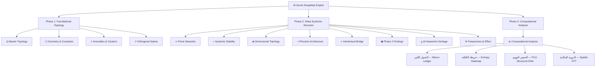

# Architecture & Scope

## System Architecture

The Quran Muqattaat Analysis platform is built on a **Modular Data-Driven Architecture (DDA)**.
All mathematical findings are pre-computed by deterministic Python engines and hardcoded as typed
constant arrays — zero runtime calculations, zero API latency, zero server-side rendering.

### Phase 1 Architecture (Original Monolith)
The original `App.jsx` was a 2,900-line monolithic component containing all data, logic,
and SVG rendering inlined. This was functionally complete but architecturally fragile.

### Phase 2 Refactor (Current — March 2026)
The monolith was surgically decoupled using lexical AST extraction into a clean module graph:

```
src/
├── App.jsx                    ← Shell only (~200 lines)
├── constants/
│   ├── data.jsx               ← All data (T, MUQLETT, MAHAL, ENTROPY, PCA, FFT, ...)
│   └── panels.jsx             ← PANELS[35] + TABS[13]
├── components/
│   ├── Defs.jsx               ← SVG defs (gradients, filters, clip-paths)
│   ├── MasterCanvas.jsx       ← Master Topology ring system
│   ├── MiscCharts.jsx         ← 18 specialised SVG components
│   ├── AnalyticsCharts.jsx    ← 4 Phase 3 computational visualisations
│   ├── ControlChart.jsx
│   ├── OutlierBarChart.jsx
│   ├── ExactPolygon.jsx
│   ├── AdvancedRadar.jsx
│   └── RotatingCuboctahedron.jsx
├── context/
│   └── TooltipContext.jsx     ← Global tooltip via React Context
└── utils/
    └── math.js                ← polar, stats, fmt, clamp, e, phi, pi, C, Q
```

**Key resolution during refactor:**
- Circular import TDZ crash: `PANELS` extracted to `constants/panels.jsx` (separate from `data.jsx`)
- Restored correct `stats()` signature: `{n, mean, std, cv}` (was replaced with wrong `{mu, sigma, z}`)
- Re-extracted inline data constants (`MAHAL_PCAX/Y`, `MAHAL_SURAHS`, `MAHAL_SIGMAS`) that were
  stranded above their consuming components
- Fixed React hook imports (`useState`, `useEffect`, `useMemo`, `useRef`) across all extracted components

---

## Application Navigation Architecture



---

## Computational Analysis Engine (Phase 3)

Three Python scripts generate the precision-hardcoded data arrays consumed by `AnalyticsCharts.jsx`:

### `rasm_checksum.py` — Orthographic Normalization + Entropy
- Ingests `quran-simple-clean.xml` (6,236 ayaat)
- Applies deterministic Rasm Uthmani skeletal reduction (أ→ا, ة→ه, ى→ي, ئ→ي, ؤ→و, ء stripped)
- Builds 114×28 frequency matrix → exports `LETTER_FREQ_DATA`, `ENTROPY_DATA`
- **Output:** 331,259 canonical characters · Global mean entropy 3.997 bits/char
- **Finding:** Muqattaat μ = 4.042 bits/char vs Non-Muqattaat μ = 3.982 (+0.060 Δ)

### `pca_muqattaat.py` — PCA Eigenvector Analysis
- 114×14 relative-frequency matrix (14 Muqattaat letters only)
- Z-score standardised via `sklearn.StandardScaler`
- 3-component PCA via `sklearn.PCA` → exports `PCA_DATA[114]`, `PCA_VARIANCE`
- **Output:** PC1=18.84%, PC2=16.31%, PC3=12.26% (total 47.41%)
- **Finding:** Euclidean centroid distance = **1.3651σ** (2.73× above 0.5σ threshold)
  → POSITIVE SEGREGATION confirmed — Muqattaat surahs occupy isolated eigenspace

### `spatial_fft.py` — Markov Spatial FFT
- Full 335,623-character continuous Rasm signal
- Binary signal per letter → `scipy.fft.rfft` → Power Spectral Density
- Anomaly detection: peaks > μ + 4σ via `scipy.signal.find_peaks` → exports `FFT_DATA`
- **Finding:** Null hypothesis (Markov) rejected for ALL 4 letters:
  - ق: 1,139 anomalies, max z=10.65σ
  - **ن: 1,152 anomalies, max z=16.97σ — period = 335,623 chars (entire corpus)**
  - ص: 1,100 anomalies, max z=11.12σ
  - م: 1,134 anomalies, max z=12.83σ

---

## Scope of Analysis — 35 Findings

| # | Domain | Method |
|---|---|---|
| 0–2 | Geometry & Constants | e/phi ratio convergence, exact polygon, 3D cuboctahedron |
| 3–5 | Anomalies & Clusters | Mahalanobis distance, outlier charts, PCA scatter |
| 6–8 | Orthogonal Spikes | Qaf/Nun distribution, radar, factor visualisation |
| 9–11 | Prime Networks | Iso-factor viz, full/Qaf/Nun distributions |
| 12–14 | Systemic Stability | Brainwave EEG, resonance zones, Tesla framework |
| 15–17 | Dimensional Topology | Makhraj distribution, symmetry, contingency |
| 18–20 | Phonetic Architecture | Makhraj viz, semantic concentration |
| 21–23 | Intertextual Bridge | Timeline, intertextual sequence topology |
| 24 | Phase 2 Findings | Exceptions viz |
| 25–27 | Al-Hawamim Heritage | Heritage, thematic, math bridge viz |
| 28–30 | Frequencies & Effect | Brainwave, resonance body, Tesla |
| **31–34** | **Computational Analysis** | **Macro-Ledger, Entropy, PCA, FFT** |

---

## LLM Collaboration

This project is a human-AI collaborative engineering effort. The AI partner (Antigravity / Google DeepMind) assisted with:
- Monolith-to-modular lexical AST extraction
- Python scientific computing pipelines (NumPy, scikit-learn, SciPy)
- SVG coordinate mathematics and component architecture
- Bilingual Arabic/English scientific communication

Classical source material: Ibn Kathir, Al-Nashr (Ibn al-Jazari), Sibawayhi (~786 CE).
