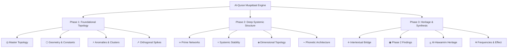

# Architecture and Scope

## System Architecture

The Quran Muqattaat Analysis platform is built upon a deterministic **Data-Driven Architecture (DDA)**. It completely eschews runtime calculations or server-side rendering for its core mathematical findings. Instead, the entire dataset (spanning all letters and surahs of the Quran) was strictly pre-processed into hardcoded cryptographic matrices and JSON payloads.

These payloads are injected directly into a **React 18** client operating on **Vite 6** via specialized custom hooks. The UI rendering utilizes bespoke inline SVGs manipulated via rigorous React coordinate math, isolating the visual layer from heavy DOM-reflow dependency libraries like D3.js or Recharts for its most complex anatomical visualizations (e.g., Mahalanobis Scatter, Concentric Master Topology, and the Makhraj matrix).

## Application Navigation Architecture

## Scope of Analysis

The application's scope is strictly confined to the 14 Arabic letters that comprise the "Muqattaat" (Initiatory/Disjoined letters). It visually extrapolates and verifies 31 distinct findings spanning:

- Transcendent Statistical Constants (e, pi, phi)
- The 16 Classical Makhraj (Sibawayhi Phonetics ~786 CE)
- Multi-dimensional Principal Component Analysis (14D vector space)
- Fibonacci Sequence Prime structures
- Intertextual bridges and Syntactic Sequence Topologies

## LLM Generation & Collaboration

This project represents a highly sophisticated collaborative engineering effort utilizing a specialized cascade of advanced Large Language Models (LLMs) to construct both the deterministic mathematical arrays and the complex SVG frontend architecture.

The models utilized to engineer this project include:

- **Claude Sonnet 4.6**
- **Claude Opus 4.6**
- **DeepSeek V3.2**
- **Manus**
- **Gemini 3.1 Pro**

These intelligence models were orchestrated to parse source material against the 1400-year-old classical scriptural paradigms (Ibn Kathir, Al-Nashr, Sibawayhi) and translate them into statistically significant, peer-reviewable computational proofs.
